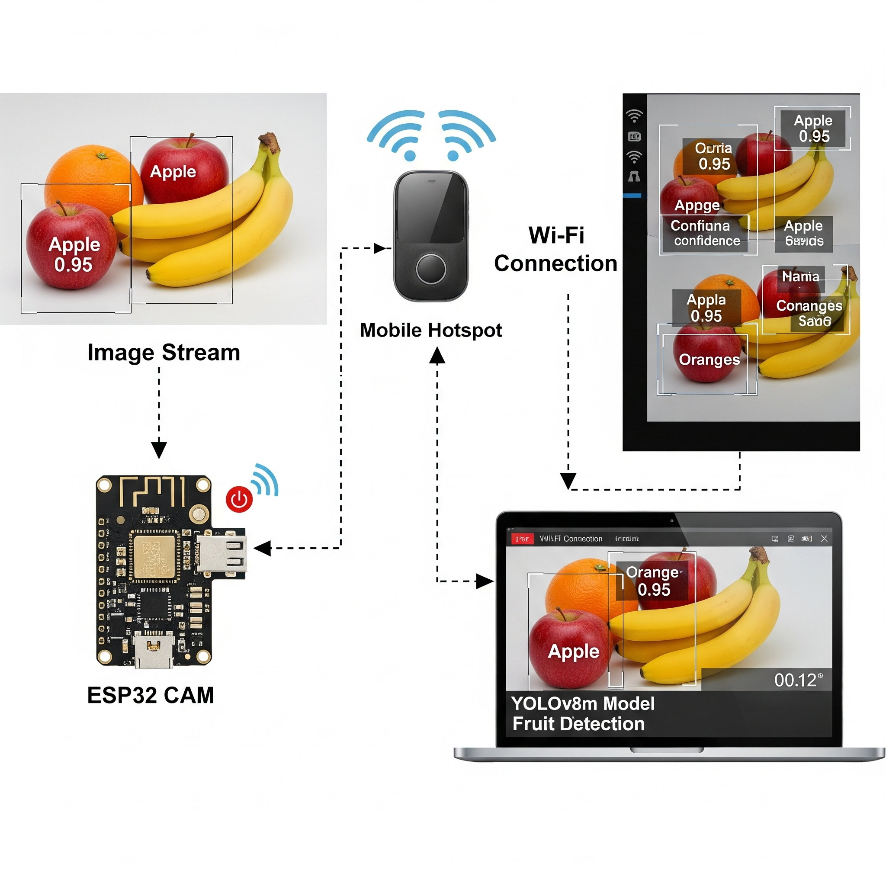

# IoT-Based Fruit Detection System using ESP32-CAM and YOLO

An IoT-based real-time fruit detection project that combines an **ESP32-CAM** for image capture with a **laptop-based deep learning inference pipeline**. The ESP32-CAM sends images over Wi-Fi, while Python and OpenCV process the incoming frames and display detected fruits with bounding boxes, labels, and confidence scores.

The project report describes a YOLOv8m-based workflow trained on a custom fruit dataset using Google Colab, while the included repository scripts provide both a **YOLOv8 webcam test script** and an **ESP32-CAM detection script using OpenCV DNN with YOLOv3-SPP weights**.

## System Architecture



### Workflow

1. The **ESP32-CAM** captures fruit images.
2. The ESP32-CAM connects to a **mobile hotspot / Wi-Fi network**.
3. The laptop fetches JPEG frames from the ESP32-CAM through an HTTP endpoint.
4. A YOLO model performs fruit detection on the received frame.
5. OpenCV draws bounding boxes, fruit names, and confidence scores.
6. The annotated output is displayed live on the laptop.

## Project Objectives

- Build a low-cost fruit detection system using ESP32-CAM and object detection.
- Transfer images wirelessly between the ESP32-CAM and laptop.
- Perform deep learning inference on an external computer because of ESP32-CAM hardware limitations.
- Display detected fruits with bounding boxes, labels, and confidence scores.
- Evaluate real-time performance while considering detection accuracy, latency, and frame rate.

## Hardware Requirements

- ESP32-CAM module
- ESP32 development/programming board
- Laptop or desktop computer
- USB cable for programming
- Mobile hotspot or Wi-Fi network
- Power bank or suitable 5V power source

## Software and Libraries

- Python 3.x
- OpenCV
- NumPy
- Requests
- Ultralytics YOLOv8
- Arduino IDE
- ESP32-CAM / `esp32cam` library

## Repository Files

```text
.
├── detection.py
├── webcam.py
├── project_diagram.png
├── best.pt                    # Required by webcam.py, if using YOLOv8
├── yolo.names                 # Required by detection.py
├── yolov3-spp.cfg             # Required by detection.py
└── yolov3-spp_final.weights   # Required by detection.py
```

> Model/configuration files are shown because the Python scripts expect them. Add them to the project directory if they are not already present.

## Detection Modes

### 1. ESP32-CAM Detection — `detection.py`

`detection.py` fetches an image from the ESP32-CAM over HTTP and runs object detection using OpenCV's DNN module.

The current ESP32-CAM endpoint in the script is:

```python
url = 'http://192.168.1.101/cam-mid.jpg'
```

The script currently loads:

```python
modelConfig = 'yolov3-spp.cfg'
modelWeights = 'yolov3-spp_final.weights'
```

It filters detections to these fruit classes:

```text
Banana
Apple
Orange
Carrot
Lemon
```

The script:

- downloads each frame from the ESP32-CAM,
- converts the JPEG response into an OpenCV image,
- rotates the frame by 180°,
- performs YOLO inference,
- applies Non-Maximum Suppression,
- draws bounding boxes and confidence scores,
- shows the result in a live OpenCV window.

Press **`q`** to stop the program.

### 2. Webcam Detection — `webcam.py`

`webcam.py` is a simple local test script for a trained **YOLOv8** model.

It loads:

```python
model = YOLO("best.pt")
```

and uses the default webcam:

```python
cap = cv2.VideoCapture(0)
```

This is useful for testing the trained YOLOv8 model before connecting the ESP32-CAM pipeline.

Press **`q`** to stop the webcam window.

## Installation

### 1. Clone the repository

```bash
git clone <your-repository-url>
cd <repository-folder>
```

### 2. Create a virtual environment

#### Windows

```bash
python -m venv venv
venv\Scripts\activate
```

#### Linux / macOS

```bash
python3 -m venv venv
source venv/bin/activate
```

### 3. Install Python dependencies

```bash
pip install opencv-python numpy requests ultralytics
```

## ESP32-CAM Setup

The project report uses ESP32-CAM firmware that exposes image endpoints such as:

```text
/cam-lo.jpg
/cam-mid.jpg
/cam-hi.jpg
```

After connecting the ESP32-CAM to the same Wi-Fi network as the laptop, find its local IP address and update the URL in `detection.py`.

For example:

```python
url = 'http://192.168.1.101/cam-mid.jpg'
```

Replace `192.168.1.101` with the IP address assigned to your ESP32-CAM.

## Running the Project

### Run ESP32-CAM detection

Make sure the ESP32-CAM is powered on and accessible from the laptop, then run:

```bash
python detection.py
```

### Run YOLOv8 webcam testing

Make sure `best.pt` is in the project directory, then run:

```bash
python webcam.py
```

## Model Training

According to the project report, the YOLOv8m model was trained using **Google Colab with a T4 GPU** on the **Fruits and Veg 2** dataset from Roboflow.

The dataset preparation process included:

- image resizing,
- normalization,
- image augmentation,
- rotation,
- flipping,
- brightness adjustment,
- training/validation/test splitting.

Training performance was evaluated using metrics such as:

- Precision
- Recall
- Mean Average Precision (mAP)
- Loss curves
- Confusion matrix

## Example Output

The live detection output displays:

- bounding boxes around detected fruits,
- detected class names,
- confidence percentages,
- continuously updated frames from the camera source.

Example label format:

```text
APPLE 95%
ORANGE 92%
BANANA 86%
```

## Key Features

- Low-cost IoT image acquisition using ESP32-CAM
- Wireless image transfer over Wi-Fi
- Real-time object detection
- Bounding-box visualization
- Confidence-score display
- Webcam-based YOLOv8 testing
- ESP32-CAM-based remote image processing
- Error handling for failed or corrupted frames

## Challenges and Limitations

The project has several practical limitations:

- The ESP32-CAM has limited memory and processing power.
- Heavy object detection models cannot run directly on the ESP32-CAM.
- Detection performance depends on Wi-Fi stability.
- Higher image resolutions require more bandwidth.
- Network delays can reduce live video smoothness.
- Laptop-side Python inference can introduce latency.
- Larger YOLO models provide better accuracy but require more computation.

## Future Improvements

Possible future extensions include:

- using lightweight or quantized YOLO models,
- improving inference speed with GPU acceleration,
- moving more processing to edge devices,
- adding cloud-based processing,
- creating a mobile application interface,
- adding real-time alerts and notifications,
- supporting multiple cameras,
- expanding the system for smart agriculture or automated retail applications.

## Project Structure Recommendation

For a cleaner GitHub repository, the project can be organized like this:

```text
fruit-detection-esp32/
├── README.md
├── detection.py
├── webcam.py
├── project_diagram.png
├── requirements.txt
├── models/
│   ├── best.pt
│   ├── yolov3-spp.cfg
│   └── yolov3-spp_final.weights
└── labels/
    └── yolo.names
```

If you move the model files into folders, remember to update their paths inside the Python scripts.

## Requirements File

You can create a `requirements.txt` file containing:

```text
opencv-python
numpy
requests
ultralytics
```

Then install everything with:

```bash
pip install -r requirements.txt
```

## Notes

- The laptop and ESP32-CAM must be connected to the same network for local HTTP communication.
- The IP address inside `detection.py` may change whenever the ESP32-CAM reconnects to the network.
- `webcam.py` requires `best.pt`.
- `detection.py` currently uses YOLOv3-SPP model files through OpenCV DNN, while the project report documents a YOLOv8m deployment pipeline.

## License

This project is intended for educational and academic use. Add a license file if you plan to distribute or reuse the project publicly.

---

**IoT + Computer Vision + ESP32-CAM + YOLO**
